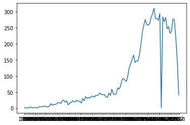
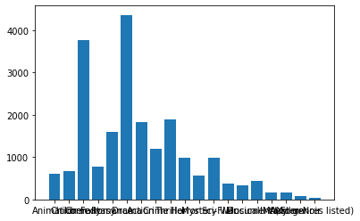

# Movie-Lens-Dataset-Visualization-and-Prediction


Summary
====

This dataset (ml-latest-small) describes 5-star rating and free-text tagging activity from [MovieLens](http://movielens.org), a movie recommendation service. It contains 100836 ratings and 3683 tag applications across 9742 movies. These data were created by 610 users between March 29, 1996 and September 24, 2018. This dataset was generated on September 26, 2018.

Users were selected at random for inclusion. All selected users had rated at least 20 movies. No demographic information is included. Each user is represented by an id, and no other information is provided.

The data are contained in the files `links.csv`, `movies.csv`, `ratings.csv` and `tags.csv`. More details about the contents and use of all these files follows.

This is a *development* dataset. As such, it may change over time and is not an appropriate dataset for shared research results. See available *benchmark* datasets if that is your intent.

This and other GroupLens data sets are publicly available for download at <http://grouplens.org/datasets/>.


Usage License
=============

Neither the University of Minnesota nor any of the researchers involved can guarantee the correctness of the data, its suitability for any particular purpose, or the validity of results based on the use of the data set. The data set may be used for any research purposes under the following conditions:

* The user may not state or imply any endorsement from the University of Minnesota or the GroupLens Research Group.
* The user must acknowledge the use of the data set in publications resulting from the use of the data set (see below for citation information).
* The user may redistribute the data set, including transformations, so long as it is distributed under these same license conditions.
* The user may not use this information for any commercial or revenue-bearing purposes without first obtaining permission from a faculty member of the GroupLens Research Project at the University of Minnesota.
* The executable software scripts are provided "as is" without warranty of any kind, either expressed or implied, including, but not limited to, the implied warranties of merchantability and fitness for a particular purpose. The entire risk as to the quality and performance of them is with you. Should the program prove defective, you assume the cost of all necessary servicing, repair or correction.

In no event shall the University of Minnesota, its affiliates or employees be liable to you for any damages arising out of the use or inability to use these programs (including but not limited to loss of data or data being rendered inaccurate).

If you have any further questions or comments, please email <grouplens-info@umn.edu>


Citation
========

To acknowledge use of the dataset in publications, please cite the following paper:

> F. Maxwell Harper and Joseph A. Konstan. 2015. The MovieLens Datasets: History and Context. ACM Transactions on Interactive Intelligent Systems (TiiS) 5, 4: 19:1–19:19. <https://doi.org/10.1145/2827872>


Further Information About GroupLens
===================================

GroupLens is a research group in the Department of Computer Science and Engineering at the University of Minnesota. Since its inception in 1992, GroupLens's research projects have explored a variety of fields including:

* recommender systems
* online communities
* mobile and ubiquitious technologies
* digital libraries
* local geographic information systems

GroupLens Research operates a movie recommender based on collaborative filtering, MovieLens, which is the source of these data. We encourage you to visit <http://movielens.org> to try it out! If you have exciting ideas for experimental work to conduct on MovieLens, send us an email at <grouplens-info@cs.umn.edu> - we are always interested in working with external collaborators.


Content and Use of Files
========================

Formatting and Encoding
-----------------------

The dataset files are written as [comma-separated values](http://en.wikipedia.org/wiki/Comma-separated_values) files with a single header row. Columns that contain commas (`,`) are escaped using double-quotes (`"`). These files are encoded as UTF-8. If accented characters in movie titles or tag values (e.g. Misérables, Les (1995)) display incorrectly, make sure that any program reading the data, such as a text editor, terminal, or script, is configured for UTF-8.


User Ids
--------

MovieLens users were selected at random for inclusion. Their ids have been anonymized. User ids are consistent between `ratings.csv` and `tags.csv` (i.e., the same id refers to the same user across the two files).


Movie Ids
---------

Only movies with at least one rating or tag are included in the dataset. These movie ids are consistent with those used on the MovieLens web site (e.g., id `1` corresponds to the URL <https://movielens.org/movies/1>). Movie ids are consistent between `ratings.csv`, `tags.csv`, `movies.csv`, and `links.csv` (i.e., the same id refers to the same movie across these four data files).


Ratings Data File Structure (ratings.csv)
-----------------------------------------

All ratings are contained in the file `ratings.csv`. Each line of this file after the header row represents one rating of one movie by one user, and has the following format:

    userId,movieId,rating,timestamp

The lines within this file are ordered first by userId, then, within user, by movieId.

Ratings are made on a 5-star scale, with half-star increments (0.5 stars - 5.0 stars).

Timestamps represent seconds since midnight Coordinated Universal Time (UTC) of January 1, 1970.


Tags Data File Structure (tags.csv)
-----------------------------------

All tags are contained in the file `tags.csv`. Each line of this file after the header row represents one tag applied to one movie by one user, and has the following format:

    userId,movieId,tag,timestamp

The lines within this file are ordered first by userId, then, within user, by movieId.

Tags are user-generated metadata about movies. Each tag is typically a single word or short phrase. The meaning, value, and purpose of a particular tag is determined by each user.

Timestamps represent seconds since midnight Coordinated Universal Time (UTC) of January 1, 1970.


Movies Data File Structure (movies.csv)
---------------------------------------

Movie information is contained in the file `movies.csv`. Each line of this file after the header row represents one movie, and has the following format:

    movieId,title,genres

Movie titles are entered manually or imported from <https://www.themoviedb.org/>, and include the year of release in parentheses. Errors and inconsistencies may exist in these titles.

Genres are a pipe-separated list, and are selected from the following:

* Action
* Adventure
* Animation
* Children's
* Comedy
* Crime
* Documentary
* Drama
* Fantasy
* Film-Noir
* Horror
* Musical
* Mystery
* Romance
* Sci-Fi
* Thriller
* War
* Western
* (no genres listed)


Links Data File Structure (links.csv)
---------------------------------------

Identifiers that can be used to link to other sources of movie data are contained in the file `links.csv`. Each line of this file after the header row represents one movie, and has the following format:

    movieId,imdbId,tmdbId

movieId is an identifier for movies used by <https://movielens.org>. E.g., the movie Toy Story has the link <https://movielens.org/movies/1>.

imdbId is an identifier for movies used by <http://www.imdb.com>. E.g., the movie Toy Story has the link <http://www.imdb.com/title/tt0114709/>.

tmdbId is an identifier for movies used by <https://www.themoviedb.org>. E.g., the movie Toy Story has the link <https://www.themoviedb.org/movie/862>.

Use of the resources listed above is subject to the terms of each provider.


Cross-Validation
----------------

Prior versions of the MovieLens dataset included either pre-computed cross-folds or scripts to perform this computation. We no longer bundle either of these features with the dataset, since most modern toolkits provide this as a built-in feature. If you wish to learn about standard approaches to cross-fold computation in the context of recommender systems evaluation, see [LensKit](http://lenskit.org) for tools, documentation, and open-source code examples.


# Movie Lens Dataset Visualisation and Analysis

This dataset (ml-latest-small) describes 5-star rating and free-text tagging activity from [`MovieLens`](http://movielens.org), a movie recommendation service. It contains __100836 ratings and 3683 tag applications across 9742 movies.__ These data were created by __610 users__ between March 29, 1996 and September 24, 2018. This dataset was generated on September 26, 2018.

## Contents
1. [Formulate questions for Analysis](#1.-Formulate-questions-for-Analysis)
2. [Import Necessary Libraries](#2.-Import-Necessary-Libraries)
3. [Read In and Explore/Analyse the Data](#3.-Read-in-and-Explore/Analyze-the-Data)
4. [Descriptive Analytics and Visualization](#4.-Descriptive-Analytics-and-Visualization)
5. [Final Summary and Results](#Final-Summary-and-Results)
6. [Model, Predict and Solve (If possible)](#6.-Model,-Predict-and-Solve)
7. [Model Evaluation (If possible)](#Results)

### 1. Formulate questions for Analysis
The main analysis will focus on answering the below questions. It's important to note that the findings in this analysis are based on a sample and are not definitive.

1. **Find the Year with most Movies released**
2. **What is the most common Genre ?**
3. **Find the Avg. Ratings given for each Movie by different Users**
4. **Movie with most No Users ratings.**
5. **Which User has Rated more no.of Movies and what is that Users Avg. Rating ?**
6. **Predict what would be the Rating a movie with specific Genres will get ?**

### 2. Import Necessary Libraries
First off, we need to import several __`Python libraries`__ such as __`numpy`__, __`pandas`__, __`matplotlib`__ and __`seaborn`__.


```python
#data analysis libraries 
import numpy as np
import pandas as pd

#visualization libraries
import matplotlib.pyplot as plt
import seaborn as sns
%matplotlib inline
#ignore warnings
import warnings
warnings.filterwarnings('ignore')
```

### 3. Read in and Explore/Analyze the Data
It's time to read in our data's using **[`pd.read_csv`](https://pandas.pydata.org/pandas-docs/stable/reference/api/pandas.read_csv.html)**, and take a first look at the dimensions and data using the **`shape()`** and **`head()`** functions.


```python
#import train and test CSV files
movie = pd.read_csv("movies.csv")
ratings = pd.read_csv("ratings.csv")
links = pd.read_csv("links.csv")
tags = pd.read_csv("tags.csv")
#take a look at the training data
print(movie.shape)
print(ratings.shape)
print(links.shape)
print(tags.shape,end="\n\n")
m=pd.read_csv("movies.csv")
movie.head(3)
links.head(3)
ratings.head(3)
tags.head(3)

#get a list of the features within the dataset
print("Movie : ", movie.columns,end="\n\n")
print("Rating : ", ratings.columns,end="\n\n")
print("Links : ", links.columns,end="\n\n")
print("Tags : ", tags.columns,end="\n\n")

movie.info()
ratings.info()
tags.info()
```

    (9742, 3)
    (100836, 4)
    (9742, 3)
    (3683, 4)
    
    Movie :  Index(['movieId', 'title', 'genres'], dtype='object')
    
    Rating :  Index(['userId', 'movieId', 'rating', 'timestamp'], dtype='object')
    
    Links :  Index(['movieId', 'imdbId', 'tmdbId'], dtype='object')
    
    Tags :  Index(['userId', 'movieId', 'tag', 'timestamp'], dtype='object')
    
    <class 'pandas.core.frame.DataFrame'>
    RangeIndex: 9742 entries, 0 to 9741
    Data columns (total 3 columns):
    movieId    9742 non-null int64
    title      9742 non-null object
    genres     9742 non-null object
    dtypes: int64(1), object(2)
    memory usage: 228.5+ KB
    <class 'pandas.core.frame.DataFrame'>
    RangeIndex: 100836 entries, 0 to 100835
    Data columns (total 4 columns):
    userId       100836 non-null int64
    movieId      100836 non-null int64
    rating       100836 non-null float64
    timestamp    100836 non-null int64
    dtypes: float64(1), int64(3)
    memory usage: 3.1 MB
    <class 'pandas.core.frame.DataFrame'>
    RangeIndex: 3683 entries, 0 to 3682
    Data columns (total 4 columns):
    userId       3683 non-null int64
    movieId      3683 non-null int64
    tag          3683 non-null object
    timestamp    3683 non-null int64
    dtypes: int64(3), object(1)
    memory usage: 115.2+ KB


* **Numerical Features:** movieId , userId , rating 
* **Categorical Features:** tags , genres 
* **Alphanumeric Features:** None

__`The data types for each feature`__
                                                                  
                                                                  
|*Name*|*Type*|
|--------------|--------------|
|**movieId**|int|
|**userId**|int|
|**title**|string|
|**genres**|string|
|**rating**|float|
|**tag**|string|

Now that we have an idea of what kinds of features we're working with, we can see how much information we have about each of them.


```python
# Droping the timestamp column from ratings and tags file
ratings.drop(columns='timestamp',inplace=True)
tags.drop(columns='timestamp',inplace=True)
```

## Some Observations:

### There are a total of `9742` `Movie's` in our dataset with `100836` `Users Rating` the movie and `3683` `Tags`. 

* **userId**: Unique Id provided for each User
 * *userId* were selected at random for inclusion. Their ids have been anonymized. User ids are consistent between `ratings.csv` and `tags.csv` (i.e., the same id refers to the same user across the two files).


* **movieId**: Unique Id provided for each Movie
 * Only movies with at least one rating or tag are included in the dataset. These movie ids are consistent with those used on the MovieLens web site (e.g., id `1` corresponds to the URL __[Movie Lens](https://movielens.org/movies/1)__. Movie ids are consistent between `ratings.csv`, `tags.csv`, `movies.csv`, and `links.csv` (i.e., the same id refers to the same movie across these four data files).


* **rating** (`rating.csv`):  Ratings are made on a 5-star scale, with half-star increments (0.5 stars - 5.0 stars).
 * All __Ratings__ are contained in the file `ratings.csv`. Each line of this file after the header row represents one rating of one movie by one user 
 * *Mean* show the average rating is **3.2-Star**


* **genres**:  Genres are a pipe-separated list, and are selected from the following:
 * *Action*
 * *Adventure*
 * *Animation*
 * *Children's*
 * *Comedy*
 * *Crime*
 * *Documentary*
 * *Drama*
 * *Fantasy*
 * *Film-Noir*
 * *Horror*
 * *Musical*
 * *Mystery*
 * *Romance*
 * *Sci-Fi*
 * *Thriller*
 * *War*
 * *Western*
 * *(no genres listed)*

#### Suggestions: 

*  _The __Timestamp__ column from both `tags.csv` and `ratings.csv` does not contribute much. So lets drop them_
* _`links.csv` has no usefull information hence lets drop the table._
* _In `movie.csv` from the **Title** column we can extrct the **year in which the movie was released.**_
* _For further prediction the **genres** column has to extracted and all Individual Genres has to br Encoded into Numerical Values ( eg. One-Hot-Encoding method )_

### 4. Descriptive Analytics and Visualization


```python
#Extracting the year from the Title
movie['Year'] = movie['title'].str.extract('.*\((.*)\).*',expand = False)
```

Now that we have extracted the __`Year`__ from the __`Tilte`__ lets find out which Year has the highest number of Movie releases


```python
#Ploting a Graph with No.of Movies each Year corresponding to its Year
plt.plot(movie.groupby('Year').title.count())
plt.show()
a=movie.groupby('Year').title.count()
print('Max No.of Movies Relesed =',a.max())
for i in a.index:
    if a[i] == a.max():
        print('Year =',i)
a.describe()
```


    

    


    Max No.of Movies Relesed = 311
    Year = 2002


    count    107.000000
    mean      90.934579
    std      102.122223
    min        1.000000
    25%       16.000000
    50%       39.000000
    75%      150.000000
    max      311.000000
    Name: title, dtype: float64


###### 1.

As per the above result we got to know that in __`2002`__ has the highest number of movie releases with __`311 Movies`__.

On an `Avg.` there are around __`90 Movies`__ releasing per __Year__.

Now Lets extract the individual __`Genres`__ from the Genres column. And lets create columns with the each `Genres` as the name and allot __`" 1 "`__  if the movie has the Genre else __`" 0 "`__


```python
# Seperate the Geners Column and Encoding them with One-Hot-Encoding Method.
genres=[]
for i in range(len(movie.genres)):
    for x in movie.genres[i].split('|'):
        if x not in genres:
            genres.append(x)  

len(genres)
for x in genres:
    movie[x] = 0
for i in range(len(movie.genres)):
    for x in movie.genres[i].split('|'):
        movie[x][i]=1
movie
```


<div>
<style scoped>
    .dataframe tbody tr th:only-of-type {
        vertical-align: middle;
    }

    .dataframe tbody tr th {
        vertical-align: top;
    }

    .dataframe thead th {
        text-align: right;
    }
</style>
<table border="1" class="dataframe">
  <thead>
    <tr style="text-align: right;">
      <th></th>
      <th>movieId</th>
      <th>title</th>
      <th>genres</th>
      <th>Year</th>
      <th>Adventure</th>
      <th>Animation</th>
      <th>Children</th>
      <th>Comedy</th>
      <th>Fantasy</th>
      <th>Romance</th>
      <th>...</th>
      <th>Horror</th>
      <th>Mystery</th>
      <th>Sci-Fi</th>
      <th>War</th>
      <th>Musical</th>
      <th>Documentary</th>
      <th>IMAX</th>
      <th>Western</th>
      <th>Film-Noir</th>
      <th>(no genres listed)</th>
    </tr>
  </thead>
  <tbody>
    <tr>
      <th>0</th>
      <td>1</td>
      <td>Toy Story (1995)</td>
      <td>Adventure|Animation|Children|Comedy|Fantasy</td>
      <td>1995</td>
      <td>1</td>
      <td>1</td>
      <td>1</td>
      <td>1</td>
      <td>1</td>
      <td>0</td>
      <td>...</td>
      <td>0</td>
      <td>0</td>
      <td>0</td>
      <td>0</td>
      <td>0</td>
      <td>0</td>
      <td>0</td>
      <td>0</td>
      <td>0</td>
      <td>0</td>
    </tr>
    <tr>
      <th>1</th>
      <td>2</td>
      <td>Jumanji (1995)</td>
      <td>Adventure|Children|Fantasy</td>
      <td>1995</td>
      <td>1</td>
      <td>0</td>
      <td>1</td>
      <td>0</td>
      <td>1</td>
      <td>0</td>
      <td>...</td>
      <td>0</td>
      <td>0</td>
      <td>0</td>
      <td>0</td>
      <td>0</td>
      <td>0</td>
      <td>0</td>
      <td>0</td>
      <td>0</td>
      <td>0</td>
    </tr>
    <tr>
      <th>2</th>
      <td>3</td>
      <td>Grumpier Old Men (1995)</td>
      <td>Comedy|Romance</td>
      <td>1995</td>
      <td>0</td>
      <td>0</td>
      <td>0</td>
      <td>1</td>
      <td>0</td>
      <td>1</td>
      <td>...</td>
      <td>0</td>
      <td>0</td>
      <td>0</td>
      <td>0</td>
      <td>0</td>
      <td>0</td>
      <td>0</td>
      <td>0</td>
      <td>0</td>
      <td>0</td>
    </tr>
    <tr>
      <th>3</th>
      <td>4</td>
      <td>Waiting to Exhale (1995)</td>
      <td>Comedy|Drama|Romance</td>
      <td>1995</td>
      <td>0</td>
      <td>0</td>
      <td>0</td>
      <td>1</td>
      <td>0</td>
      <td>1</td>
      <td>...</td>
      <td>0</td>
      <td>0</td>
      <td>0</td>
      <td>0</td>
      <td>0</td>
      <td>0</td>
      <td>0</td>
      <td>0</td>
      <td>0</td>
      <td>0</td>
    </tr>
    <tr>
      <th>4</th>
      <td>5</td>
      <td>Father of the Bride Part II (1995)</td>
      <td>Comedy</td>
      <td>1995</td>
      <td>0</td>
      <td>0</td>
      <td>0</td>
      <td>1</td>
      <td>0</td>
      <td>0</td>
      <td>...</td>
      <td>0</td>
      <td>0</td>
      <td>0</td>
      <td>0</td>
      <td>0</td>
      <td>0</td>
      <td>0</td>
      <td>0</td>
      <td>0</td>
      <td>0</td>
    </tr>
    <tr>
      <th>...</th>
      <td>...</td>
      <td>...</td>
      <td>...</td>
      <td>...</td>
      <td>...</td>
      <td>...</td>
      <td>...</td>
      <td>...</td>
      <td>...</td>
      <td>...</td>
      <td>...</td>
      <td>...</td>
      <td>...</td>
      <td>...</td>
      <td>...</td>
      <td>...</td>
      <td>...</td>
      <td>...</td>
      <td>...</td>
      <td>...</td>
      <td>...</td>
    </tr>
    <tr>
      <th>9737</th>
      <td>193581</td>
      <td>Black Butler: Book of the Atlantic (2017)</td>
      <td>Action|Animation|Comedy|Fantasy</td>
      <td>2017</td>
      <td>0</td>
      <td>1</td>
      <td>0</td>
      <td>1</td>
      <td>1</td>
      <td>0</td>
      <td>...</td>
      <td>0</td>
      <td>0</td>
      <td>0</td>
      <td>0</td>
      <td>0</td>
      <td>0</td>
      <td>0</td>
      <td>0</td>
      <td>0</td>
      <td>0</td>
    </tr>
    <tr>
      <th>9738</th>
      <td>193583</td>
      <td>No Game No Life: Zero (2017)</td>
      <td>Animation|Comedy|Fantasy</td>
      <td>2017</td>
      <td>0</td>
      <td>1</td>
      <td>0</td>
      <td>1</td>
      <td>1</td>
      <td>0</td>
      <td>...</td>
      <td>0</td>
      <td>0</td>
      <td>0</td>
      <td>0</td>
      <td>0</td>
      <td>0</td>
      <td>0</td>
      <td>0</td>
      <td>0</td>
      <td>0</td>
    </tr>
    <tr>
      <th>9739</th>
      <td>193585</td>
      <td>Flint (2017)</td>
      <td>Drama</td>
      <td>2017</td>
      <td>0</td>
      <td>0</td>
      <td>0</td>
      <td>0</td>
      <td>0</td>
      <td>0</td>
      <td>...</td>
      <td>0</td>
      <td>0</td>
      <td>0</td>
      <td>0</td>
      <td>0</td>
      <td>0</td>
      <td>0</td>
      <td>0</td>
      <td>0</td>
      <td>0</td>
    </tr>
    <tr>
      <th>9740</th>
      <td>193587</td>
      <td>Bungo Stray Dogs: Dead Apple (2018)</td>
      <td>Action|Animation</td>
      <td>2018</td>
      <td>0</td>
      <td>1</td>
      <td>0</td>
      <td>0</td>
      <td>0</td>
      <td>0</td>
      <td>...</td>
      <td>0</td>
      <td>0</td>
      <td>0</td>
      <td>0</td>
      <td>0</td>
      <td>0</td>
      <td>0</td>
      <td>0</td>
      <td>0</td>
      <td>0</td>
    </tr>
    <tr>
      <th>9741</th>
      <td>193609</td>
      <td>Andrew Dice Clay: Dice Rules (1991)</td>
      <td>Comedy</td>
      <td>1991</td>
      <td>0</td>
      <td>0</td>
      <td>0</td>
      <td>1</td>
      <td>0</td>
      <td>0</td>
      <td>...</td>
      <td>0</td>
      <td>0</td>
      <td>0</td>
      <td>0</td>
      <td>0</td>
      <td>0</td>
      <td>0</td>
      <td>0</td>
      <td>0</td>
      <td>0</td>
    </tr>
  </tbody>
</table>
<p>9742 rows × 24 columns</p>
</div>


Now that we have the data in the Genres Column converted in to Numerical values in different columns, Lets Drop the Genres Column


```python
movie.drop(columns='genres',inplace=True)
movie.sort_index(inplace=True)
```


```python
x={}
for i in movie.columns[4:23]:
    x[i]=movie[i].value_counts()[1]
    print("{}    \t\t\t\t{}".format(i,x[i]))

plt.bar(height=x.values(),x=x.keys())
plt.show()
```

    Animation    				611
    Children    				664
    Comedy    				3756
    Fantasy    				779
    Romance    				1596
    Drama    				4361
    Action    				1828
    Crime    				1199
    Thriller    				1894
    Horror    				978
    Mystery    				573
    Sci-Fi    				980
    War    				382
    Musical    				334
    Documentary    				440
    IMAX    				158
    Western    				167
    Film-Noir    				87
    (no genres listed)    				34


    

    


###### 2.

From the above we can say that __`Drama`__ is the most Comman Genre released in the Movie Field with __`4361` Movies__ followed by __Comedy__ with __`3756` Movies__ and so on ...........

##### 3.

As we can see that each movies is being rated by many Users, lets Group them by **`"movieId"`** and rate each movie with the mean of the Rating given by different Users.


```python
#Add a Column `rating` in movie DF and assign them with the Mean Movie Rating for that Movie.
x=ratings.groupby('movieId').rating.mean()
movie = pd.merge(movie,x,how='outer',on='movieId')
movie['rating'].fillna('0',inplace=True)
```


```python
# Now Lets group all the ratings with respect to movieId and count the no of Users
x = ratings.groupby('movieId',as_index=False).userId.count()
x.sort_values('userId',ascending=False,inplace=True)
y = pd.merge(movie,x,how='outer',on='movieId')

y.drop(columns=[i for i in movie.columns[2:23]],inplace=True)

y.sort_values(['userId','rating'],ascending=False)
```


<div>
<style scoped>
    .dataframe tbody tr th:only-of-type {
        vertical-align: middle;
    }

    .dataframe tbody tr th {
        vertical-align: top;
    }

    .dataframe thead th {
        text-align: right;
    }
</style>
<table border="1" class="dataframe">
  <thead>
    <tr style="text-align: right;">
      <th></th>
      <th>movieId</th>
      <th>title</th>
      <th>rating</th>
      <th>userId</th>
    </tr>
  </thead>
  <tbody>
    <tr>
      <th>314</th>
      <td>356</td>
      <td>Forrest Gump (1994)</td>
      <td>4.16413</td>
      <td>329.0</td>
    </tr>
    <tr>
      <th>277</th>
      <td>318</td>
      <td>Shawshank Redemption, The (1994)</td>
      <td>4.42902</td>
      <td>317.0</td>
    </tr>
    <tr>
      <th>257</th>
      <td>296</td>
      <td>Pulp Fiction (1994)</td>
      <td>4.19707</td>
      <td>307.0</td>
    </tr>
    <tr>
      <th>510</th>
      <td>593</td>
      <td>Silence of the Lambs, The (1991)</td>
      <td>4.16129</td>
      <td>279.0</td>
    </tr>
    <tr>
      <th>1939</th>
      <td>2571</td>
      <td>Matrix, The (1999)</td>
      <td>4.19245</td>
      <td>278.0</td>
    </tr>
    <tr>
      <th>...</th>
      <td>...</td>
      <td>...</td>
      <td>...</td>
      <td>...</td>
    </tr>
    <tr>
      <th>5749</th>
      <td>30892</td>
      <td>In the Realms of the Unreal (2004)</td>
      <td>0</td>
      <td>NaN</td>
    </tr>
    <tr>
      <th>5824</th>
      <td>32160</td>
      <td>Twentieth Century (1934)</td>
      <td>0</td>
      <td>NaN</td>
    </tr>
    <tr>
      <th>5837</th>
      <td>32371</td>
      <td>Call Northside 777 (1948)</td>
      <td>0</td>
      <td>NaN</td>
    </tr>
    <tr>
      <th>5957</th>
      <td>34482</td>
      <td>Browning Version, The (1951)</td>
      <td>0</td>
      <td>NaN</td>
    </tr>
    <tr>
      <th>7565</th>
      <td>85565</td>
      <td>Chalet Girl (2011)</td>
      <td>0</td>
      <td>NaN</td>
    </tr>
  </tbody>
</table>
<p>9742 rows × 4 columns</p>
</div>


###### 4.

From the above table we can say that __`Forest Gump (1994)`__ has the ___Highest___ no.of. Ratings with __`4.16 Stars` by `329 Users`__ as average.

Followed by __`Shawshank Redemption, The (1994)`__ with __`317 User Ratings`__ and __`4.42 Stars`__ as average and so on.


```python
#find the user with highest no.of. movie ratings and that users mean rating. 
x = ratings.groupby('userId',as_index=False).movieId.count()
y = ratings.groupby('userId',as_index=False).rating.mean()
x = pd.merge(x,y,how='outer',on='userId')
```


```python
x.describe()
```


<div>
<style scoped>
    .dataframe tbody tr th:only-of-type {
        vertical-align: middle;
    }

    .dataframe tbody tr th {
        vertical-align: top;
    }

    .dataframe thead th {
        text-align: right;
    }
</style>
<table border="1" class="dataframe">
  <thead>
    <tr style="text-align: right;">
      <th></th>
      <th>userId</th>
      <th>movieId</th>
      <th>rating</th>
    </tr>
  </thead>
  <tbody>
    <tr>
      <th>count</th>
      <td>610.000000</td>
      <td>610.000000</td>
      <td>610.000000</td>
    </tr>
    <tr>
      <th>mean</th>
      <td>305.500000</td>
      <td>165.304918</td>
      <td>3.657222</td>
    </tr>
    <tr>
      <th>std</th>
      <td>176.236111</td>
      <td>269.480584</td>
      <td>0.480635</td>
    </tr>
    <tr>
      <th>min</th>
      <td>1.000000</td>
      <td>20.000000</td>
      <td>1.275000</td>
    </tr>
    <tr>
      <th>25%</th>
      <td>153.250000</td>
      <td>35.000000</td>
      <td>3.360000</td>
    </tr>
    <tr>
      <th>50%</th>
      <td>305.500000</td>
      <td>70.500000</td>
      <td>3.694385</td>
    </tr>
    <tr>
      <th>75%</th>
      <td>457.750000</td>
      <td>168.000000</td>
      <td>3.997500</td>
    </tr>
    <tr>
      <th>max</th>
      <td>610.000000</td>
      <td>2698.000000</td>
      <td>5.000000</td>
    </tr>
  </tbody>
</table>
</div>


```python
x.sort_values('movieId',ascending=False)
```


<div>
<style scoped>
    .dataframe tbody tr th:only-of-type {
        vertical-align: middle;
    }

    .dataframe tbody tr th {
        vertical-align: top;
    }

    .dataframe thead th {
        text-align: right;
    }
</style>
<table border="1" class="dataframe">
  <thead>
    <tr style="text-align: right;">
      <th></th>
      <th>userId</th>
      <th>movieId</th>
      <th>rating</th>
    </tr>
  </thead>
  <tbody>
    <tr>
      <th>413</th>
      <td>414</td>
      <td>2698</td>
      <td>3.391957</td>
    </tr>
    <tr>
      <th>598</th>
      <td>599</td>
      <td>2478</td>
      <td>2.642050</td>
    </tr>
    <tr>
      <th>473</th>
      <td>474</td>
      <td>2108</td>
      <td>3.398956</td>
    </tr>
    <tr>
      <th>447</th>
      <td>448</td>
      <td>1864</td>
      <td>2.847371</td>
    </tr>
    <tr>
      <th>273</th>
      <td>274</td>
      <td>1346</td>
      <td>3.235884</td>
    </tr>
    <tr>
      <th>...</th>
      <td>...</td>
      <td>...</td>
      <td>...</td>
    </tr>
    <tr>
      <th>441</th>
      <td>442</td>
      <td>20</td>
      <td>1.275000</td>
    </tr>
    <tr>
      <th>568</th>
      <td>569</td>
      <td>20</td>
      <td>4.000000</td>
    </tr>
    <tr>
      <th>319</th>
      <td>320</td>
      <td>20</td>
      <td>3.525000</td>
    </tr>
    <tr>
      <th>575</th>
      <td>576</td>
      <td>20</td>
      <td>3.100000</td>
    </tr>
    <tr>
      <th>52</th>
      <td>53</td>
      <td>20</td>
      <td>5.000000</td>
    </tr>
  </tbody>
</table>
<p>610 rows × 3 columns</p>
</div>


###### 5.

From above we found that __`userId`__ - __`414`__ has given the Highest no.of Ratings with __`2698`__ and an Average of __`3.39 Stars`__ followed by __`userId`__-__`599`__ with __`2478`__ Ratings and an Average of __`2.64 Stars`__ and so on ...

### Final Summary and Results

1. **Find the Year with most Movies Released**
 * The Year with most no.of Movies Released is __`2002`__ with __`311`__ Movie
 
 
 * __[`Click to see the Output`](#1.)__
 


2. **What is the most Common Genre ?**
 * The Most comman Genre is __`Drama`__ with __`4361 Movies`__ followed by __`Comedy`__ with __`3756 Movies`__
 
 
 * __[`Click to see the Output`](#2.)__
 


3. **Find the Avg. Ratings given for each movie by different users**
 * The Avg. Rating for each Movie is calculated and updated to the Movie DataFrame
 
 
 * __[`Click to see the Output`](#3.)__


4. **Movie with most No Users ratings.**
 *  The Movie with most no.of Users ratings is __`Forest Gump (1994)`__ with Highest no.of. Ratings with __`4.16 Stars`__ by __`329 Users`__ as Average followed by __`Shawshank Redemption, The (1994)`__ with __`317 User Ratings`__ and __`4.42 Stars`__ as Average.
 
 
 * __[`Click to see the Output`](#4.)__
 


5. **Which User has Rated More No. of Movies And what is that users Avg. Rating ?**
 * The User with Highest no.of Ratings and their Avg. Rating is __`userId`__ - __`414`__ with __`2698`__ no.of Ratings and a Average Rating of __`3.39 Stars`__ followed by __`userId`__-__`599`__ with __`2478`__ Ratings with Average Rating of __`2.64 Stars`__
 
 
 * __[`Click to see the Output`](#1.)__


```python
for i in movie.columns[3:]:
    movie[i] = movie[i].astype(int)
```

### 6. Model, Predict and Solve


```python
#importing necessary packages for model prediction and evaluation
import sklearn
from sklearn.ensemble import RandomForestRegressor
from sklearn.metrics import mean_absolute_error
from sklearn.model_selection import train_test_split
```

We will use ___[`RandomForestRegressor`](https://scikit-learn.org/stable/modules/generated/sklearn.ensemble.RandomForestRegressor.html)___ Model to `Predict` the Rating of a movie with it's Genres given.


```python
#split the data into features and results
X = movie[movie.columns[3:23]]
y = movie[movie.columns[-1]]
```

As we know that the Genres are Enocded (with __[`One-Hot-Encoding`](https://scikit-learn.org/stable/modules/generated/sklearn.ensemble.RandomForestRegressor.html)__ method) which is from the `3'rd` column to the `23rd` column are set as `features` and the `Ratings` (last column) is the expected `result`.


```python
#spliting the data into Train Test and Validation sets
X_train , X_test , y_train , y_test = train_test_split(X ,y ,test_size=0.20 ,random_state = 1 ,shuffle = True)
```

Using __`sklearn.model_selection.train_test_split`__ function we will split the whole data into `train` data and `test` data

Here I am assigning __`20%`__ for `test` data and the rest __`80%`__ for `training` data


```python
model = RandomForestRegressor(n_estimators=560,random_state=42)
model.fit(X_train,y_train)
print(mean_absolute_error(model.predict(X_train),y_train))
```

    0.6273838864882512


For the __`Exact`__ same Data that we trained with,gives a error of __`0.62 stars`__

I have set the `n_estimators` to __`560`__ as it is results in `less error` than others after manually testing with multiple values.

Now let's try `predicting` the Ratings with the `Test data` and see the output and how well the model predicted.


```python
preds = model.predict(X_test)
preds
```


    array([4.13091037, 2.70301961, 3.02737812, ..., 3.27549095, 3.19069404,
           3.15317189])


```python
print(mean_absolute_error(y_test,preds))
```

    0.7005609442537233


From the above results we can say that the model perdicts the Ratings for a movie with __&#177; `0.70`__ deviated from the actual value.

### Results

As the analysis are based on a sample and are not definitive the model is quite reliable and for Predicting the `Rating` of a `Movie` with it's `Genres` given
